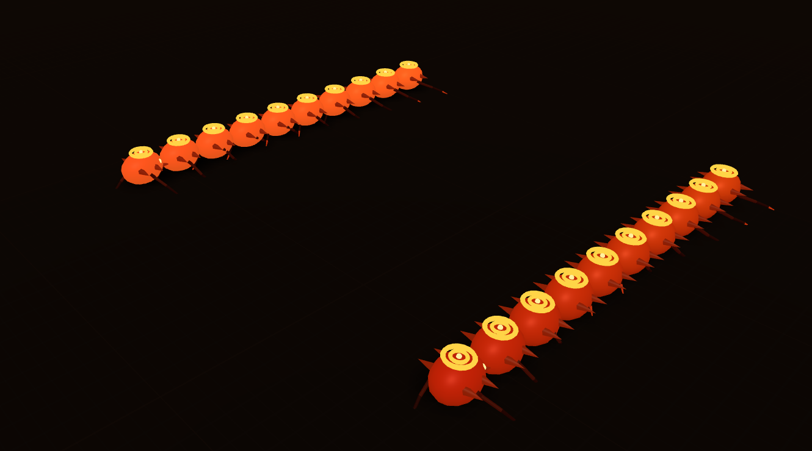

# DECIPEDE_LAB

A segmented crawler that learns to walk, in a single HTML file. A chain of hinge-jointed body segments with articulated legs discovers a forward gait from scratch. Two training regimes share the same body and physics:

* **Learn** (default): reinforcement learning. One shared policy drives every body, collects reward, and updates its own weights by gradient ascent (PPO with a value baseline, GAE, and Adam). The creature genuinely improves within a single run, from its own experience.
* **Evolve**: the original genetic algorithm. A population of frozen brains, selection and mutation across generations. Search, not learning, kept for comparison.

Gait emerges from the network, not animation. In learn mode the phase clock is only an input the policy may read; the coordination is discovered, not scripted.

**Subject:** `myriapoda-ignis-digitalis` · **v0.3**

## Try it

It's one self-contained page. Two runtime dependencies (`three@0.160.0` and `cannon-es@0.20.0`) load from CDN via an importmap, so it needs an internet connection but no install and no build step.

* **Hosted:** open the GitHub Pages URL (Settings → Pages → deploy from branch).
* **Local:** because it's an ES-module page, a raw `file://` double-click is blocked in most browsers. Serve it instead:

  ```bash
  python -m http.server 8000
  # then open http://localhost:8000/decipede-evolve-3d.html
  ```

## What it does

Each creature is a chain of rigid segments joined by yaw-bending hinge motors, with 4-segment articulated legs (coxa → femur → tibia → tarsus) per side, simulated in cannon-es.

**Learn mode** runs one policy network across the whole population at once. The N bodies act as N parallel environments feeding a single learner. Every timestep the policy sees per-segment proprioception (orientation, angular velocity, height, uprightness, a phase clock) plus body velocity, and outputs per-joint motor speeds and per-side leg drives. It gets a dense reward each step (forward progress, with small terms for staying upright and alive), and after each trial a PPO update pushes the weights up the reward gradient. Nothing about the gait is hardcoded; the network has to find the coordination itself.

**Evolve mode** is the earlier design: a per-creature network, fitness measured as forward displacement over a trial, tournament selection with elitism, crossover, and Gaussian mutation. No gradients, no within-life learning.

Both write a fitness/reward curve per trial to the graph on the right, in the same units, so the two regimes are directly comparable.

## Controls

* **Learn / Evolve**: pick the training regime (switching resets into that mode)
* **Run / Pause / Skip Gen / Reset**: run control (Skip Gen forces the current trial to end and update)
* **Learning Rate / Exploration / PPO Epochs**: live RL hyperparameters (learn mode)
* **Population / Mutation Rate / Sim Speed / Segments**: live sliders (Segments rebuilds the body plan)
* **Training Mode**: flat track, no obstacles, no checkpoints (on by default)
* **Export ★ / Import**: download or load the current policy (learn) or best brain (evolve) as JSON
* **Load Auto / Clear Auto**: reseed from, or wipe, the autosave (`localStorage`, keyed per mode and body shape)
* **Camera**: follow / free / top

The Learning panel on the right shows live PPO diagnostics: mean reward, policy entropy, policy and value loss, and approximate KL. A live gen/run overlay sits top-left.

## Layout

```
proj_decipede/
├── decipede-evolve-3d.html   ← the whole app
├── decipede.png              ← banner
└── archive/
    ├── centipede-evolve.html ← the 2D predecessor
    └── *.json                ← an early exported champion brain
```

## License

MIT. See [LICENSE](LICENSE).
